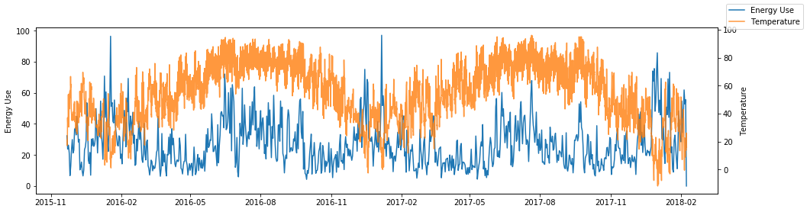
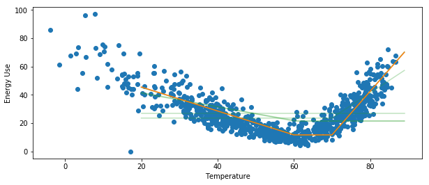
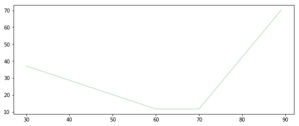

Basic Usage
===========

Loading sample data
-------------------

EEMeter comes packages with some simulated sample data.

.. note::

    This data is not to be used for methods testing! It is designed to have
    obvious (but completely unrealistic) behavior to showcase building
    temperature response.

See a list of available sample data files, use :any:`eemeter.samples`::

    >>> eemeter.samples()
    ['il-electricity-cdd-hdd-hourly',
     'il-electricity-cdd-hdd-daily',
     'il-electricity-cdd-hdd-billing_monthly',
     'il-electricity-cdd-hdd-billing_bimonthly',
     'il-electricity-cdd-only-hourly',
     'il-electricity-cdd-only-daily',
     'il-electricity-cdd-only-billing_monthly',
     'il-electricity-cdd-only-billing_bimonthly',
     'il-gas-hdd-only-hourly',
     'il-gas-hdd-only-daily',
     'il-gas-hdd-only-billing_monthly',
     'il-gas-hdd-only-billing_bimonthly',
     'il-gas-intercept-only-hourly',
     'il-gas-intercept-only-daily',
     'il-gas-intercept-only-billing_monthly',
     'il-gas-intercept-only-billing_bimonthly']

Load meter data, temperature data, and metadata, use :any:`eemeter.load_sample`::

    >>> meter_data, temperature_data, metadata = \
    ...     eemeter.load_sample('il-electricity-cdd-hdd-daily')
    >>> meter_data.head()
                               value
    start
    2015-11-22 00:00:00+00:00  32.34
    2015-11-23 00:00:00+00:00  23.80
    2015-11-24 00:00:00+00:00  26.26
    2015-11-25 00:00:00+00:00  21.32
    2015-11-26 00:00:00+00:00   6.70
    >>> temperature_data.head()
    dt
    2015-11-22 06:00:00+00:00    21.01
    2015-11-22 07:00:00+00:00    20.35
    2015-11-22 08:00:00+00:00    19.38
    2015-11-22 09:00:00+00:00    19.02
    2015-11-22 10:00:00+00:00    17.82
    Name: tempF, dtype: float64

The metadata :any:`dict` contains simulated project ground truth, such as roughly
expected disaggregated annual usage, savings, and project dates.

Loading data from CSV
---------------------

Default meter data CSV format::

    start,value
    2015-11-22T00:00:00+00:00,32.34
    2015-11-23T00:00:00+00:00,23.80
    2015-11-24T00:00:00+00:00,26.26
    2015-11-25T00:00:00+00:00,21.32
    2015-11-26T00:00:00+00:00,6.70
    ...

To load meter data from a CSV, use :any:`eemeter.meter_data_from_csv`::

    >>> meter_data = eemeter.meter_data_from_csv(f)  # file handle

The :any:`eemeter.meter_data_from_csv` has lots of configurable options for
data that is formatted differently! Check out the API docs for more info.

Default temperature data CSV format::

    dt,tempF
    2015-11-22T00:00:00+06:00,21.01
    2015-11-22T01:00:00+06:00,20.35
    2015-11-22T02:00:00+06:00,19.38
    2015-11-22T03:00:00+06:00,19.02
    2015-11-22T04:00:00+06:00,17.82
    ...

To load temperature data from a CSV, use :any:`eemeter.temperature_data_from_csv`.
(See also :any:`EEweather <eeweather:index>`)::

    >>> temperature_data = eemeter.temperature_data_from_csv(f)  # file handle

The :any:`eemeter.temperature_data_from_csv` also has lots of configurable
options for data that is formatted differently! Check out the API docs for
more info.

These methods also work with gzipped files (e.g., the sample data)::

    >>> meter_data = eemeter.meter_data_from_csv(f, gzipped=True)

If frequency is known (``'hourly'``, ``'daily'``), this will load that data
with an index of the appropriate frequency. This helps the data formatting
methods do the right thing.

::

    >>> daily_meter_data = eemeter.meter_data_from_csv(f, freq='daily')

Creating design matrix datasets
-------------------------------

To merge temperature data with meter data, use :any:`eemeter.merge_temperature_data`::

    >>> meter_data, temperature_data, metadata = \
    ...     eemeter.load_sample('il-electricity-cdd-hdd-daily')
    >>> data = eemeter.merge_temperature_data(meter_data, temperature_data)

By default, this will give you a :any:`pandas.DataFrame` with two columns:
``meter_value`` and ``temperature_mean``::

    >>> data.head()
                               meter_value  temperature_mean
    2015-11-22 00:00:00+00:00        32.34         26.740000
    2015-11-23 00:00:00+00:00        23.80         38.831667
    2015-11-24 00:00:00+00:00        26.26         41.304583
    2015-11-25 00:00:00+00:00        21.32         49.198333
    2015-11-26 00:00:00+00:00         6.70         57.856667

Other options for constructing datasets are available, such as data quality::

    >>> data = eemeter.merge_temperature_data(
    ...     meter_data, temperature_data, temperature_mean=False,
    ...     data_quality=True)
    >>> data.head()
                               meter_value  temperature_not_null  temperature_null
    start
    2015-11-22 00:00:00+00:00        32.34                    18               0.0
    2015-11-23 00:00:00+00:00        23.80                    24               0.0
    2015-11-24 00:00:00+00:00        26.26                    24               0.0
    2015-11-25 00:00:00+00:00        21.32                    24               0.0
    2015-11-26 00:00:00+00:00         6.70                    24               0.0

To make a dataset with computed heating and cooling degrees for balance point
ranges, you can use the following::

    >>> data = eemeter.merge_temperature_data(
    ...     meter_data, temperature_data, temperature_mean=False,
    ...     heating_balance_points=[60, 61], cooling_balance_points=[70])
    >>> data.head()
                               meter_value  cdd_70     hdd_60     hdd_61  \
    2015-11-22 00:00:00+00:00        32.34     0.0  33.260000  34.260000   
    2015-11-23 00:00:00+00:00        23.80     0.0  21.168333  22.168333   
    2015-11-24 00:00:00+00:00        26.26     0.0  18.695417  19.695417   
    2015-11-25 00:00:00+00:00        21.32     0.0  10.801667  11.801667   
    2015-11-26 00:00:00+00:00         6.70     0.0   2.143333   3.143333   

                               n_days_dropped  n_days_kept  
    2015-11-22 00:00:00+00:00             0.0          1.0  
    2015-11-23 00:00:00+00:00             0.0          1.0  
    2015-11-24 00:00:00+00:00             0.0          1.0  
    2015-11-25 00:00:00+00:00             0.0          1.0  
    2015-11-26 00:00:00+00:00             0.0          1.0  

Running the CalTRACK methods
----------------------------

.. note::

    For complete compliance with CalTRACK methods, please ensure that input
    data meets requirements in section 2.1 of the CalTRACK methods
    specification and uses settings defined in :doc:`caltrack_compliance`.

To run the CalTRACK daily or billing methods, you need a :any:`pandas.DataFrame` with
the following columns:

- ``meter_value``: Daily average metered usage values for each point.
- ``cdd_<cooling_balance_point>``: Average period daily cooling degree days for
  a particular cooling balance point.
- ``hdd_<heating_balance_point>``: Average period daily heating degree days for
  a particular heating balance point.

For each balance point you want to include in the grid search, you must
provide a separate ``cdd_<>`` or ``hdd_<>`` column.

Armed with this DataFrame (:any:`eemeter.merge_temperature_data` is a utility
that simplifies the process of creating this DataFrame), you can use
:any:`eemeter.caltrack_method` to fit a model.

You may also wish to filter your data to a baseline period or a reporting
period. To do so, use :any:`eemeter.get_baseline_data` or
:any:`eemeter.get_reporting_data`. For example::

    >>> import datetime
    >>> import pytz
    >>> datetime.datetime(2016, 12, 26, 0, 0, tzinfo=pytz.UTC)
    >>> baseline_data, warnings = eemeter.get_baseline_data(
    ...     data, end=baseline_end_date, max_days=365)
    >>> print(baseline_data.head())
                               meter_value  cdd_70     hdd_60     hdd_61  \
    2015-12-27 00:00:00+00:00        25.55     0.0  18.093333  19.093333   
    2015-12-28 00:00:00+00:00        26.46     0.0  22.478333  23.478333   
    2015-12-29 00:00:00+00:00        30.38     0.0  25.003333  26.003333   
    2015-12-30 00:00:00+00:00        49.82     0.0  29.161667  30.161667   
    2015-12-31 00:00:00+00:00        34.47     0.0  29.572917  30.572917   

                               n_days_dropped  n_days_kept  
    2015-12-27 00:00:00+00:00             0.0          1.0  
    2015-12-28 00:00:00+00:00             0.0          1.0  
    2015-12-29 00:00:00+00:00             0.0          1.0  
    2015-12-30 00:00:00+00:00             0.0          1.0  
    2015-12-31 00:00:00+00:00             0.0          1.0  

CalTRACK Daily Methods
----------------------

Running caltrack daily methods is easy once you have the data in the right
format. This method returns a :any:`eemeter.ModelFit` object::

    >>> model_fit = eemeter.caltrack_method(data)

This object can be dumped into a JSON string::

    >>> import json
    >>> model_fit = eemeter.caltrack_method(data)
    >>> print(json.dumps(model_fit.json(), indent=2))

It can be inspected for more detailed information::

    >>> model_fit.r_squared
    0.7294645737524558

Or plotted (use with :any:`eemeter.plot_energy_signature` for an overlay on the
fitted data)::

    >>> model_fit.plot()

CalTRACK Billing Methods
------------------------

Running caltrack billing methods::

    >>> model_fit = eemeter.caltrack_method(data, use_billing_preset=True)

It is essential that the data used in the CalTRACK billing methods is
*average daily* period usage (UPDm) and degree day values.

Data with this property is created by default by the
:any:`eemeter.merge_temperature_data` method, but can be controlled explicitly
with the ``use_mean_daily_values`` flag of that method.

Using the CLI
-------------

The CLI can be used to run the caltrack methods directly against CSV data. To
allow users without immediate access to data to get started quickly with the
eemeter package, the CLI also allow using sample data that comes with eemeter.

Use CalTRACK methods on sample data::

    $ eemeter caltrack --sample=il-electricity-cdd-hdd-daily
    Loading sample: il-electricity-cdd-hdd-daily
    {
      "status": "SUCCESS",
      "method_name": "caltrack_daily_method",
      "model": {
        "model_type": "cdd_hdd",
        "formula": "meter_value ~ cdd_65 + hdd_55",
        "status": "QUALIFIED",
        "model_params": {
          "intercept": 10.733478866990144,
          "beta_cdd": 2.039525988684711,
          "beta_hdd": 1.0665644257451434,
          "cooling_balance_point": 65,
          "heating_balance_point": 55
        },
        "r_squared": 0.7810065909435654,
        "warnings": []
      },
      "r_squared": 0.7810065909435654,
      "warnings": [],
      "metadata": {},
      "settings": {
        "fit_cdd": true,
        "minimum_non_zero_cdd": 10,
        "minimum_non_zero_hdd": 10,
        "minimum_total_cdd": 20,
        "minimum_total_hdd": 20,
        "beta_cdd_maximum_p_value": 0.1,
        "beta_hdd_maximum_p_value": 0.1
      }
    }

Save output::

    $ eemeter caltrack --sample=il-electricity-cdd-only-billing_monthly \
    --output-file=/path/to/output.json
    Loading sample: il-electricity-cdd-only-billing_monthly
    Output written: /path/to/output.json

Load custom data (see sample files for example format)::

    $ eemeter caltrack --meter-file=/path/to/meter/data.csv \
    --temperature-file=/path/to/temperature/data.csv

Do not fit CDD models (intended for gas data)::

    $ eemeter caltrack --sample=il-gas-hdd-only-billing_monthly --no-fit-cdd

To include all candidate models in output::

    $ eemeter caltrack --sample=il-electricity-cdd-hdd-daily --show-candidates

Understanding eemeter warnings
------------------------------

The eemeter package tries to give warnings whenever a result is less than
perfect. Warnings appear throughout the eemeter and are given in the structure
:any:`eemeter.EEMeterWarning`.

Each warning has the following structure:

1. A 'dotted' hierarchical name (:any:`eemeter.EEMeterWarning.qualified_name`)
   summarizing its origin and nature. For example:
   ``'eemeter.caltrack_method.no_candidate_models'``
2. A full description of the error in prose
   (:any:`eemeter.EEMeterWarning.description`).
3. A set of relevant data about the error, such as limits that were passed (
   :any:`eemeter.EEMeterWarning.data`).

Visualization
-------------

Plotting results and models.

Plot an energy signature (:any:`eemeter.plot_energy_signature`)::

    >>> eemeter.plot_energy_signature(meter_data, temperature_data)

.. image:: _static/plot_energy_signature.png

Plot a time series of meter data and temperature data
(:any:`eemeter.plot_time_series`)::

    >>> eemeter.plot_time_series(meter_data, temperature_data)

Plot a model fit and all candidate models (:any:`eemeter.ModelFit.plot`)
on top of an energy signature::

    >>> ax = eemeter.plot_energy_signature(meter_data, temperature_data)
    >>> model_fit.plot(ax=ax, with_candidates=True)

Plot a single candidate model (:any:`eemeter.CandidateModel.plot`)::

    >>> model_fit.model.plot()

The plot functions are flexible and can take quite a few parameters, including
custom titles, labels, Matplotlib Axes, and color options.

Obtaining weather data
----------------------

Weather data can be obtained using the :any:`EEweather <eeweather:index>` package.

Definitely check out the full docs, but here's a taste of what that's like.

Installation::

    $ pip install eeweather

Usage::

    >>> import eeweather
    >>> result = eeweather.match_lat_long(35, -95)
    >>> result
    ISDStationMapping('722178')
    >>> result.distance_meters
    34672
    >>> station = result.isd_station
    >>> station
    ISDStation('722178')
    >>> import datetime
    >>> import pytz
    >>> start_date = datetime.datetime(2016, 6, 1, tzinfo=pytz.UTC)
    >>> end_date = datetime.datetime(2017, 9, 15, tzinfo=pytz.UTC)
    >>> tempC = station.load_isd_hourly_temp_data(start_date, end_date)
    >>> tempC.head()
    2016-06-01 00:00:00+00:00    28.291500
    2016-06-01 01:00:00+00:00    27.438500
    2016-06-01 02:00:00+00:00    27.197083
    2016-06-01 03:00:00+00:00    26.898750
    2016-06-01 04:00:00+00:00    26.701810
    Freq: H, dtype: float64
    >>> tempF = tempC * 1.8 + 32
    >>> tempF.head()
    2016-06-01 00:00:00+00:00    82.924700
    2016-06-01 01:00:00+00:00    81.389300
    2016-06-01 02:00:00+00:00    80.954750
    2016-06-01 03:00:00+00:00    80.417750
    2016-06-01 04:00:00+00:00    80.063259

.. _anaconda:

Using with Anaconda
-------------------

Some users find that the easiest way to get a working Python distributions
is to use Anaconda (hello Windows users!). Anaconda is a free distribution of
Python that comes with all of the dependencies of eemeter and a host of other
useful scientific packages.

If that sounds appealing to you, please follow the
`installation instructions <https://www.anaconda.com/download/>`_
that Anaconda provides, then come back here armed with a shiny new python
distribution and install eemeter at an anaconda shell with
`$ pip install eemeter`.
